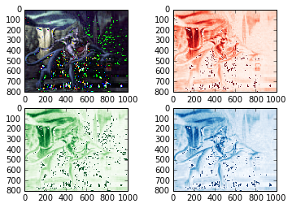

UECM3033 Assignment #2 Report
========================================================

- Prepared by: NgKeJie
- Tutorial Group: T2

--------------------------------------------------------

## Task 1 --  $LU$ Factorization or SOR method

The reports, codes and supporting documents are to be uploaded to Github at: 

https://github.com/NGKEJIE/UECM3033_assign2

Explain your selection criteria here.

The condition is set by condition = np.count_nonzero(A) > 1/2* len(A). 
It means that when the non-zero elements in matrix A is greater than half of the matrix A. 
Then, we use the LU Method. Otherwise, we use SOR method. 
 
Explain how you implement your `task1.py` here.

In task 1, we define the function of LU method and SOR method. After that, we set the iteration limit equal to 10 to prevent it to loop infinity times.
Omega equal to 1.03. If the omega,w  0 < w < 1, SOR method converges but the convergence rate is slower than the Gauss-Seidal method. If 1 < w < 2, SOR method converges but the convergence rate is faster than the Gauss-Seidal method. If w > 2,  SOR method will diverge.
We use np.array to make the A and b to be a matrix, and use astype float to convert it to float. Then, used np.linalg.solve(A,b) and solve(A,b) to check with the condition.
Finally, we display the answer.
---------------------------------------------------------

## Task 2 -- SVD method and image compression

Put here your picture file (moon_rider.jpg)

How many non zero element in $\Sigma$?

There are 800 non zero elements in Sigma for three colors, red, green and blue.

Put here your lower and better resolution pictures. 

The lower resolution:

The better resolution:

Explain how you generate these pictures from `task2.py`.

First, we generate the self defined function as svd. Then, we read the image "moon_rider.png" and use numpy function to find the non zero elements in $\Sigma$. We keep the first 30 non-zero elements as in $\Sigma$ to compress the image and set all other non-zero elements to zero. We use sp.linalg.diagsvd to change the dimension(800x1000) which is originally (800,1). A new matrix is created by the dot multiplication of np.dot. Then, all the process is repeated by green and blue matrices. After all this, another figure is plotted which shows a lower resolution. In part 4, a new better resolution can be plotted by calling the self define function again.

What is a sparse matrix?

In numerical analysis, a sparse matrix is a matrix in which most of the elements are zero. By contrast, if most of the elements are nonzero, then the matrix is considered dense. The fraction of non-zero elements over the total number of elements (i.e., that can fit into the matrix, say a matrix of dimension of m x n can accommodate m x n total number of elements) in a matrix is called the sparsity (density).
In this case, we keep the first 30 non zero elements and set other elements to be zero and we change the dimension of the sigma from (800,1) to (800,1000) which created a sparse matrix of (800,1000) dimension matrix. This matrix is used for dot multiplication as mention above. Because the sparse matrix most elements is zero, this eventually help to make the lower resolutuon pictures.

-----------------------------------

last modified: 11/3/2016
